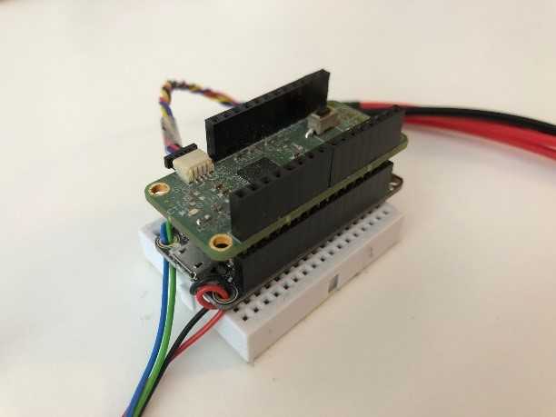

# FreiStat - Potentiostat - GUI
Contributors: 
- Mark Jasper

Supervision:
- Jochen Kieninger


Contacts: 
- Mark Jasper, mark.jasper@imtek.uni-freiburg.de
- Dr. Jochen Kieninger, kieninger@imtek.uni-freiburg.de

[Laboratory for Sensors](https://www.imtek.de/laboratories/sensors/sensors_home?set_language=en), IMTEK, University of Freiburg



## About FreiStat
The FreiStat is an open-source small scale potentiostat on the basis of the 
AD5941 potentiostat chip of Analog Devices Inc. and an Adafruit Feather M0. 

The FreiStat supports communication over serial USB, WiFi or as a standalone microcontroller software.

## About
This repository contains the GUI of the FreiStat Python library. For running this GUI
the main [FreiStat-Framework](https://github.com/IMTEK-FreiStat/FreiStat-Framework) is required.

### Python library requirements
* Requirements are installed automatically when installing the package via pip install. This automatically installs the correct version of the FreiStat-Framework.

## Electrochemical methods
The FreiStat software allows for running different electrochemical methods by 
sending JSON-telegrams to the microcontroller. The supported ec-methods are:
* Chronoamperometry (CA) 
* Linear Sweep Voltammetry (LSV)
* Cyclic Voltammetry (CV)
* Normal Pulse Voltammetry (NPV)
* Differential Pulse Voltammetery (DPV)
* Square Wave Voltammetery (SWV)
* Arbitrary sequences of the above stated electrochemical methods

### Parametrization of the electrochemical methods
All ec-methods are parametrized in the Python library when calling the facade
of the chosen method.

All parameters are explained in the function calls of the methods, but the 
different parameters of the different ec-methods are also additionally listed
below.

General limits of operation:

- FixedWEPotential: True -> Voltage range = 2.1 V
- FixedWEPotential: Flase -> Voltage range = ±2.0 V
- Max. current = ±4.5 mA 

### Chronoamperometry
Chronoamperometry with a defined sampling rate of values, independent of the 
chosen pulse length. After the sampling time is over, the data is send in a JSON 
frame (see section about JSON-telegrams) to the Python library  where it is 
stored and displayed.

Parameters:
- Potential_Steps : List of potential steps in V (limited to 50 values)
- Pulse_Lengths : List of pulse lenghts in s (need to match length of potential step list)
- Sampling_Rate : Sampling rate in s
- Cycle : Amount of cycles
- CurrentRange : Current range at which the potentiostat should operate in A
- FixedWEPotential : Use a fixed potential for the working electrode
- MainsFilter : Actiavete the 50/ 60 Hz mains filter
- Sinc2_Oversampling : Oversampling rate for Sinc2
- Sinc3_Oversampling : Oversampling rate for Sinc3
- EnableOptimizer : Enable the optimzier which tunes the parameters
- LowPerformanceMode : Disabling the plotting of the data

Limits of operation:

- Sampling rate > 3 ms
- Amount of distinct steps = 50

### Linear Sweep Voltammetry
Linear sweep voltammetry with current averaging. After each voltage step the data is
send in a JSON frame (see section about JSON-telegrams) to the Python library 
where it is stored and displayed. 
Supports sweeping up or down, depending on the chosen values for the StartVoltage
and StopVoltage.

Parameters:
- StartVoltage : Starting potential in V at which the LSV should start sweeping
- StopVoltage : Stop potential in V at which the LSV should stop sweeping
- Stepsize : Stepsize in V (min 537 uV)
- Scanrate : Scanrate in V/s 
- Cycle : Amount of cycles
- CurrentRange : Current range at which the potentiostat should operate in A
- FixedWEPotential : Use a fixed potential for the working electrode
- MainsFilter : Actiavete the 50/ 60 Hz mains filter
- Sinc2_Oversampling : Oversampling rate for Sinc2
- Sinc3_Oversampling : Oversampling rate for Sinc3
- EnableOptimizer : Enable the optimzier which tunes the parameters
- LowPerformanceMode : Disabling the plotting of the data

Limits of operation:

- Stepsize / Scanrate > 2.875 ms


### Cyclic Voltammetry
Cyclic voltammetry with current averaging. After each voltage step the data is
send in a JSON frame (see section about JSON-telegrams) to the Python library 
where it is stored and displayed.
Supports sweeping up or down, depending on the chosen values for the FirstVertex and SecondVertex: 
- Sweeping down : FirstVertex < SecondVertex
- Sweeping up : SecondVertex < FirstVertex


Parameters:
- StartVoltage : Starting potential in V at which the CV should start ramping up
- FirstVertex : Potential of the first vertex in V
- SecondVertex : Potential of the second vertex in V
- Stepsize : Stepsize in V (min 537 uV)
- Scanrate : Scanrate in V/s 
- Cycle : Amount of cycles
- CurrentRange : Current range at which the potentiostat should operate in A
- FixedWEPotential : Use a fixed potential for the working electrode
- MainsFilter : Actiavete the 50/ 60 Hz mains filter
- Sinc2_Oversampling : Oversampling rate for Sinc2
- Sinc3_Oversampling : Oversampling rate for Sinc3
- EnableOptimizer : Enable the optimzier which tunes the parameters
- LowPerformanceMode : Disabling the plotting of the data

Limits of operation:

- Stepsize / Scanrate > 2.875 ms


### Normal Pulse Voltammetry
After each voltage step the data is send in a JSON frame (see section about JSON-telegrams) to the Python library where it is stored and displayed.

Parameters:
- BaseVoltage : Base Potential which the FreiStat should apply in V
- StartVoltage : Potential of the first peak in V
- StopVoltage : Potential of the last peak in V
- DeltaV_Staircase : Increament per peak in V
- Pulse_Lengths [Tau' Tau] : Pulse lengths in s
- Sampling_Duration : Time defining how long data should be sampled at the end of each step in s.
- Cycle : Amount of cycles
- CurrentRange : Current range at which the potentiostat should operate in A
- FixedWEPotential : Use a fixed potential for the working electrode
- MainsFilter : Actiavete the 50/ 60 Hz mains filter
- Sinc2_Oversampling : Oversampling rate for Sinc2
- Sinc3_Oversampling : Oversampling rate for Sinc3
- EnableOptimizer : Enable the optimzier which tunes the parameters
- LowPerformanceMode : Disabling the plotting of the data

Limits of operation:

- Tau and Tau' > 3 ms
- Sinc2_Oversampling * Sinc3_Oversampling / 800 000 Hz < Sampling_Duration

### Differential Pulse Voltammetry
After each voltage step the data is send in a JSON frame (see section about JSON-telegrams) to the Python library where it is stored and displayed.

Parameters:
- StartVoltage : Potential at which the DPV should start in V
- StopVoltage : Potential at which the DPV should stop in V
- DeltaV_Staircase : Increament of the underlying staircase in V
- DeltaV_Peak : Size of the peak in V
- Pulse_Lengths [Tau' Tau] : Pulse lengths in s
- Sampling_Duration : Time defining how long data should be sampled at the end of each step in s.
- Cycle : Amount of cycles
- CurrentRange : Current range at which the potentiostat should operate in A
- FixedWEPotential : Use a fixed potential for the working electrode
- MainsFilter : Actiavete the 50/ 60 Hz mains filter
- Sinc2_Oversampling : Oversampling rate for Sinc2
- Sinc3_Oversampling : Oversampling rate for Sinc3
- EnableOptimizer : Enable the optimzier which tunes the parameters
- LowPerformanceMode : Disabling the plotting of the data

Limits of operation:

- Tau and Tau' > 3 ms
- Sinc2_Oversampling * Sinc3_Oversampling / 800 000 Hz < Sampling_Duration

### Square Wave Voltammetry
After each voltage step the data is send in a JSON frame (see section about JSON-telegrams) to the Python library where it is stored and displayed.

Parameters:
- StartVoltage : Potential at which the SWV should start in V
- StopVoltage : Potential at which the SWV should stop in V
- DeltaV_Staircase : Increament of the underlying staircase in V
- DeltaV_Peak : Size of the peak in V
- DutyCycle : Length of the duty cycle in s
- Sampling_Duration : Time defining how long data should be sampled at the end of each step in s.
- Cycle : Amount of cycles
- CurrentRange : Current range at which the potentiostat should operate in A
- FixedWEPotential : Use a fixed potential for the working electrode
- MainsFilter : Actiavete the 50/ 60 Hz mains filter
- Sinc2_Oversampling : Oversampling rate for Sinc2
- Sinc3_Oversampling : Oversampling rate for Sinc3
- EnableOptimizer : Enable the optimzier which tunes the parameters
- LowPerformanceMode : Disabling the plotting of the data

Limits of operation:

- DutyCycle / 2 > 3 ms
- Sinc2_Oversampling * Sinc3_Oversampling / 800 000 Hz < Sampling_Duration

### Sequence of electrochemical methods
The sequnece mode of the FreiStat allows for chaining different electrochemical.
methods after each other which are then executed in order for a defined amount
of cycles.

Parameters:
- SequenceCycles : Amount of cycles

Limits of operation:
- The sequence can't exceed a length of 35 due to the limited memory of the
  Microcontroller

## How to use the code
* Follow the instructions on the FreiStat-Framework page
* Include the FreiStat GUI
  ```
  FreiStat_GUI.Main_Window import FreiStatInterface

  FreiStatInterface()
  ```
* Alternatively run the Main.py